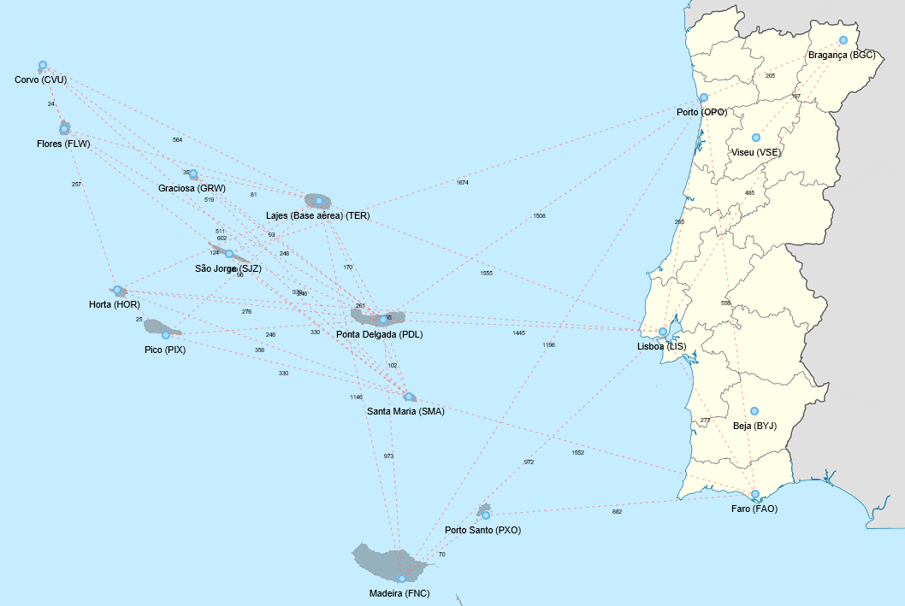
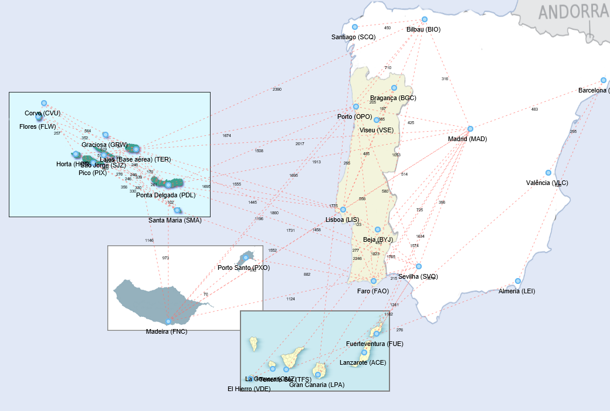
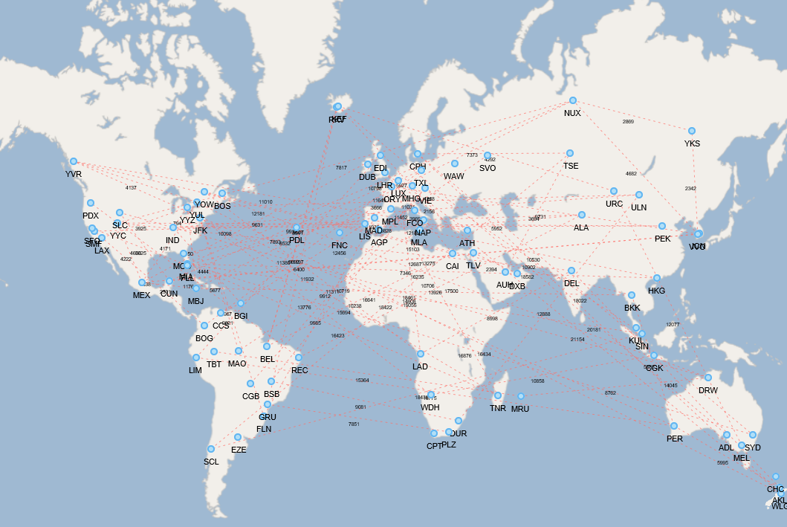

# Projeto PA 2021/22 - Época Recurso/Especial

O enunciado relativamente ao projeto encontra-se no Moodle.

Este template *IntelliJ* deve servir de base de desenvolvimento para este trabalho e o seu versionamento interno dentro de cada grupo feito através do *Git*.

## Estrutura de ficheiros/pastas

- `/dataset` - contém os *datasets* a importar pela aplicação
- `/src` - contém o código-fonte da aplicação
    - `com.brunomnsilva.smartgraph` - *package* que contém a biblioteca [JavaFXSmartGraph](https://github.com/brunomnsilva/JavaFXSmartGraph). Não é esperado que tenha de fazer modificações a estas classes.
    - `model.pa` - *package* principal da aplicação.
        - `*.graph` - *package* que contém o ADT Graph e uma implementação funcional baseada em "lista de arestas".
        - `*.model` - *package* que contém o modelo de classes da aplicação desenvolvida.
        - `*.view` - *package* que contém as classes gráficas da aplicação desenvolvida.
    - `Main.java` - classe que contém o ponto de entrada para a aplicação.
- `/test` - (a criar) contém os testes unitários da aplicação
- `smartgraph.css` - *stylesheet* utilizado pela biblioteca JavaFXSmartGraph (pode alterar)
- `smartgraph.properties` - *propriedades* utilizadas pela biblioteca JavaFXSmartGraph (não é necessário alterar, já contém definições adequadas)
- `README.md` - este ficheiro. Podem alterar o conteúdo, se entenderem.

## Dados para importação

Os ficheiros estão em formato de texto, embora possam conter números; poderão existir comentários - essas linhas começam pelo caráter `"#"` e devem ser ignoradas durante a leitura.

Os *datasets* encontram-se na pasta local `dataset`, portanto qualquer ficheiro localizado nessa pasta pode ser aberto com, e.g., `new FileReader("dataset/<folder>/<file>.txt")`, sendo `<file>` o ficheiro respetivo a abrir.

Existem três *datasets*:
-`luso` contendo informação de aeroportos e rotas em Portugal (incluindo ilhas);
-`iberian` contendo informação de aeroportos e rotas em na Península Ibérica (incluindo ilhas);
-`world` contendo informação de aeroportos e rotas em vários aeroportos no mundo;

Cada dataset contem os seguintes ficheiros:

- `name.txt` - Código (IATA) e nomes/cidades onde estão localizados os *aeroportos*;
- `weight.txt` - Informação adicional sobre os *aeroportos* - Nome oficial, latitude, longitude e altitude média;
- `xy.txt` - Coordenadas (de ecrã) estão localizados os *aeroportos*;

- `routes_*.txt` - Ficheiro com as distâncias das rotas a considerar entre aeroportos específicos - pode haver diferentes versões (sufixo) deste ficheiro, e.g., `"_1"` e `"_2"`.

### Relação da informação entre ficheiros

Os ficheiros `name.txt`, `weight.txt` e `xy.txt` contêm o **mesmo número N de entradas válidas**; cada linha respetiva contém informação de um aeroporto. Ou seja, a informação na linha (válida) L de um ficheiro relaciona-se com a informação da linha L de outro ficheiro (ignorando as linhas com comentários).

Os ficheiros `routes_*.txt` contêm uma "lista de distâncias" entre aeroportos específicos no formato seguinte:

    # Lista de rotas disponíveis
    # Lisboa --> Funchal
    LIS 966 FNC
    # Barajas (Madrid) --> John F. Kennedy (New York)
    MAD 5761 JFK
    # Lisboa --> John F. Kennedy (New York)
    LIS 5405 JFK
    # Barajas (Madrid) --> Lisboa
    MAD 514 LIS

Existe ainda uma pasta denominada img onde poderá existir um ficheiro com o nome "back.png" que poderá ser usado como imagem de fundo `/back.png`. 
### Exemplo de modelo importado

A título de exemplo, mostra-se o resultado esperado da importação dos dois datasets, podendo variar o 
ficheiro das rotas. Note que a disposição relativa das cidades (vértices) é um mapeamento geograficamente realista. 

### Dataset: luso

Rotas em `routes_1.txt` (grafo bipartido - 2 componentes):

### Dataset: iberian

Rotas em `routes_1.txt` (1 componente):

### Dataset: world

Rotas em `routes_1.txt`

Rotas em `routes_2.txt`

